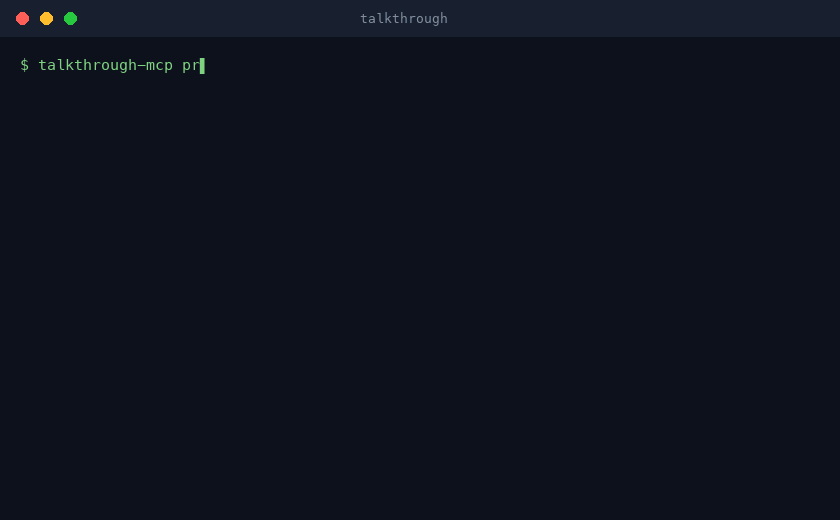

# talkthrough-mcp

[](https://github.com/korovin-aa97/talkthrough-mcp/actions/workflows/ci.yml)
[](LICENSE)
[](pyproject.toml)
<!-- uncomment at PyPI publish: [](https://pypi.org/project/talkthrough-mcp/) -->

**Feedback ingestion for AI agents.** Record your screen and talk; your agent
does the rest — files the bugs, writes the spec, builds the backlog.



`talkthrough-mcp` is a local-first MCP server that turns a narrated screen
recording (or any video/audio file) into agent-ready structured data:
timestamped transcript segments, scene-change keyframes, OCR'd on-screen text,
and wall-clock anchoring. Everything is served through lazy retrieval tools, so
a 30-minute recording never floods the model context — the agent pulls exactly
the transcript slice, moment bundle, or frame it needs.

There is no LLM inside the server and no cloud anywhere in the path: ffmpeg,
faster-whisper, and RapidOCR run on your machine, and the calling agent brings
the intelligence. What makes it different from screen-recorder SaaS and
video-analyzer MCPs: it works on arbitrary local files, it ships the agent
workflows (server prompts + example agents), and it anchors every timestamp to
**wall-clock time** — so "the moment I said the checkout hung" maps straight to
the right window of your server logs.

## Quickstart

One command, no system dependencies: ffmpeg falls back to a bundled build,
OCR is pip-only, and whisper models download themselves on first use.

### Claude Code

```bash
# private-phase install (needs git access to the repo):
claude mcp add -s user talkthrough -- uvx --from git+https://github.com/korovin-aa97/talkthrough-mcp talkthrough-mcp
```

Or install the full plugin (server + the five workflow commands + the triage
agent + an agent skill):

```
/plugin marketplace add korovin-aa97/talkthrough-mcp
/plugin install talkthrough@talkthrough
```

### Claude Desktop

`claude_desktop_config.json`:

```json
{
  "mcpServers": {
    "talkthrough": {
      "command": "uvx",
      "args": [
        "--from",
        "git+https://github.com/korovin-aa97/talkthrough-mcp",
        "talkthrough-mcp"
      ]
    }
  }
}
```

### Cursor

`~/.cursor/mcp.json` — same `command`/`args` block as Claude Desktop.

### Everything else that speaks MCP

Per-engine setup folders with exact config snippets live in
[`integrations/`](integrations/): **Codex CLI · OpenClaw · Gemini CLI ·
Cursor · Cline/Roo · OpenCode · Goose · Copilot CLI · Windsurf · Zed** —
plus the Claude Code plugin and a Claude Desktop `.mcpb` draft. Any other
MCP stdio client works with the same `uvx` command. Agents can self-install
via [`llms-install.md`](llms-install.md).

### Local checkout (development)

```bash
git clone https://github.com/korovin-aa97/talkthrough-mcp
claude mcp add talkthrough -- uv run --directory /path/to/talkthrough-mcp talkthrough-mcp
```

Then, in your agent:

> Process `~/Desktop/recording.mov` and triage it — or just invoke the
> `triage-recording` server prompt.

## Tools

| Tool | What it does |
|---|---|
| `process_media(path, recorded_at?, vocabulary?, language?, force?)` | Ingest a video/audio file: local STT, keyframes, OCR, wall-clock. Returns a compact summary. Idempotent by content hash — re-calls are instant. |
| `get_transcript(job_id, start_ms?, end_ms?, format?)` | Paginated transcript as `segments`, `text`, or `srt`; truncation returns `next_start_ms`. |
| `get_frames(job_id, at_ms? \| start_ms?+end_ms?, max_frames?, include_duplicates?)` | Keyframe images nearest a timestamp or evenly thinned across a range (unique frames by default, max 6/call). |
| `get_moment(job_id, start_ms, end_ms)` | The "one remark" bundle: transcript slice + up to 3 frames + their OCR text + wall-clock range. |
| `search(job_id, query)` | Substring search over the transcript AND on-screen OCR text; hits carry `t_ms`/`t_wall` and frame refs. |
| `extract_frame(job_id, at_ms, crop?)` | Exact-timestamp full-resolution re-extract from the source video (optional crop) when keyframes miss the instant. |
| `list_jobs()` | Recent processed recordings with durations, wall-clock starts, and counts. |

Every tool description ships 10+ usage examples, so agents pick the right tool
without extra prompting.

## Server prompts (slash commands in MCP clients)

| Prompt | Workflow |
|---|---|
| `triage-recording` | Narrated screencast → precise findings JSON (bug/feature/question routing, frame evidence) |
| `spec-from-workshop` | Recorded workshop → structured spec with quoted decisions and open questions |
| `backlog-from-demo` | Product demo → prioritized backlog with timestamped evidence |
| `meeting-actions` | Meeting audio → action items, decisions, open questions |
| `correlate-with-logs` | Recording remarks ↔ system logs via wall-clock windows |

The same prompts live as plain files in [`examples/prompts/`](examples/prompts/)
if your client doesn't surface MCP prompts. The findings contract used by
`triage-recording` is [`examples/output-contract.schema.json`](examples/output-contract.schema.json).

## Wall-clock anchoring

Every timestamped result carries both `t_ms` (video-relative) and `t_wall`
(ISO 8601 real time) once the recording start is known. Resolution ladder:

1. `recorded_at` parameter (agent/user override) → confidence `exact`
2. QuickTime `com.apple.quicktime.creationdate` tag, carries the local
   timezone (QuickTime Player recordings; ⌘⇧5 wrote it before macOS 26) → `high`
3. Container `creation_time` tag (UTC) → `medium` — macOS 26+ ⌘⇧5/ReplayKit
   screen recordings land here (no `creationdate` tag anymore); pass
   `recorded_at=` when local-tz `t_wall` matters
4. File mtime minus duration (recorders finalize files at recording END) → `low`
5. Nothing → tools still work with relative `t_ms` only

Why it matters: "the upload spinner froze *here*" becomes a ±30 s grep window
in your server logs.

## Privacy

Everything runs locally: your recordings never leave your machine, speech is
transcribed by a local whisper model, OCR is local ONNX inference, and there is
no telemetry. The only network access is one-time tool/model downloads (ffmpeg
build, whisper model, OCR models).

## Transcription quality

The default whisper model is `small` (good English/major-language accuracy on
CPU). For non-English narration or tricky audio, set:

```bash
TALKTHROUGH_WHISPER_MODEL=medium   # or large-v3 (slower, best quality)
```

Feed product names via the `vocabulary` parameter — it biases the decoder so
jargon survives transcription.

## Configuration

| Env var | Default | Meaning |
|---|---|---|
| `TALKTHROUGH_WHISPER_MODEL` | `small` | whisper model name (`tiny`/`base`/`small`/`medium`/`large-v3`) |
| `TALKTHROUGH_OCR` | `on` | set `off` to skip OCR |
| `TALKTHROUGH_MAX_SECONDS` | `7200` | max media duration |
| `TALKTHROUGH_MAX_FRAMES` | `600` | keyframe cap per job |
| `TALKTHROUGH_HOME` | `~/.talkthrough` | job store root |

## CLI

The pipeline is also a CLI — useful for pre-processing long recordings outside
an agent session (the store is content-addressed, so the agent then queries the
same job instantly):

```bash
talkthrough-mcp process ~/Videos/long-session.mov   # prints the summary
talkthrough-mcp process demo.mov --json             # machine-readable
talkthrough-mcp gc --keep-days 30                   # clean the job store
talkthrough-mcp serve                               # stdio MCP server (default)
```

First run notes: missing system ffmpeg triggers a one-time `static-ffmpeg`
download; the first transcription downloads the whisper model (~460 MB for
`small`); both are cached. A long video takes minutes — progress streams as MCP
progress notifications, and the CLI prints stage lines.

## Supported inputs

Video: `.mov` `.mp4` `.webm` `.mkv` — audio-only: `.m4a` `.mp3` `.wav` `.ogg`
`.flac` (transcript tools only; frame tools explain why they're unavailable).
Local files only.

## How it compares

| | talkthrough | cloud recorder SaaS | meeting notetakers | typical video-analyzer MCPs |
|---|---|---|---|---|
| Runs fully locally | ✅ | ❌ | ❌ | varies |
| Any local video/audio file | ✅ | browser/app captures | meetings only | ✅ |
| Wall-clock anchoring (log correlation) | ✅ | ❌ | ❌ | ❌ |
| Ships agent workflows (prompts, skill, findings contract) | ✅ | ❌ | ❌ | ❌ |
| OCR of on-screen text, searchable | ✅ | some | ❌ | rare |

## For agents & tooling

Machine-readable entry points, so AI agents can install and use this server
without a human reading docs:

- [`llms-install.md`](llms-install.md) — step-by-step install instructions for agents
- [`llms.txt`](llms.txt) — index of the documentation
- [`.agents/skills/talkthrough/SKILL.md`](.agents/skills/talkthrough/SKILL.md) — an [Agent Skill](https://agentskills.io) teaching the tool workflow; discovered automatically inside a checkout by Codex CLI (`$talkthrough`) and readable by Claude Code, Cursor, Copilot, Gemini CLI and other SKILL.md-compatible tools
- [`AGENTS.md`](AGENTS.md) — instructions for coding agents contributing to this repo
- [`server.json`](server.json) — MCP registry manifest
- [`integrations/`](integrations/) — per-engine adapters, all generated from one source of truth and drift-tested (incl. the Claude Code plugin under [`integrations/claude-code/`](integrations/claude-code/))

## Roadmap (not in v1)

URL/YouTube ingestion · speaker diarization · cloud STT · embeddings/semantic
search · hosted/remote mode · `.mcpb` bundle · whisper.cpp backend · Windows CI
(code stays OS-neutral; Windows is best-effort).

## License

MIT
