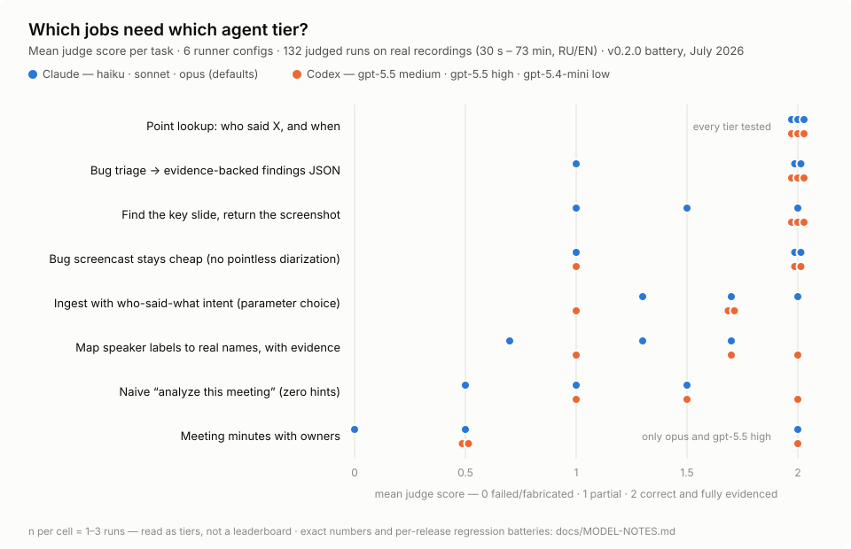

# Benchmarks — which agent models drive talkthrough well?

**150 runs across 6 model configurations** on real recordings — that is the
core battery we ran against v0.2.0 (132 judge-scored agent runs + 18
mechanical failure-literacy checks), followed by targeted regression
batteries on every release since (36 runs for v0.2.1, 20 for v0.2.2, 18 for
v0.2.3 — 224 runs total). Same verbatim prompts across all runners, real
meetings and screencasts from one team's actual work (30 s – 73 min, RU/EN,
1–5 speakers, headcounts confirmed by the recording owner).

This page is the shareable summary. The full matrices — score × wall time ×
tokens on every task/model/recording intersection, plus each release's
addendum — live in [docs/MODEL-NOTES.md](../docs/MODEL-NOTES.md).

<picture>
  <source media="(prefers-color-scheme: dark)" srcset="scores-by-task-dark.svg">
  
</picture>

*Runner configs: Claude haiku / sonnet / opus at default settings; Codex
gpt-5.5 at medium and high reasoning effort, gpt-5.4-mini at low. Score:
2 = correct and fully evidenced, 1 = partial, 0 = failed or fabricated.*

## Three findings

1. **Retrieval works on every tier tested.** Point lookups ("who said X,
   and when") went 18/18 including the smallest config; search, slide
   hunts, and evidence-backed bug triage were solid from haiku and
   gpt-5.4-mini upward. If your agents mostly *ask questions about
   recordings*, the model tier barely matters.

2. **Synthesis wants the top tiers — and reasoning effort moved results
   more than model family.** Meeting minutes with owners and
   evidence-disciplined speaker-name mapping reached full marks only on
   opus and gpt-5.5-high; mid tiers partially succeeded, small tiers
   fabricated or refused. On identical prompts, gpt-5.5 medium → high moved
   full-pass from 64% to 88% — a bigger swing than switching families.

3. **The transferable MCP-builder finding: put facts in payloads, not
   prose.** Description-level guidance reached only the Claude runners;
   data fields in tool *responses* were read by every model tested. The
   v0.2.3 battery added a second universal channel: one sentence in the
   server's `initialize.instructions` fixed findings-key canon 4/4 —
   including the runner that never fetches descriptions or MCP prompts.
   Contracts that must reach every client belong in tool responses and
   server instructions.

The battery is also how the server got hardened: raw threshold cluster
counts reported as headcounts ("123 speakers"), pointless diarization of
single-voice screencasts, and description-only escalation notes were all
caught here and fixed at the server level, then verified by re-running the
failing scenario (0/12 recurrences on the headcount case).

## Honest limits

- **Small n.** 1–3 runs per cell in the core grid; read tiers and
  patterns, not decimals. It's a methodology plus a data cut — not a
  leaderboard.
- **One corpus.** Five recordings from one team; length, language, and
  speaker count correlate across them, so the per-axis cuts are
  observational.
- **Snapshot.** July 2026 models; they drift. Re-run before trusting a
  cell a year later.
- **Token counts aren't cross-family comparable** (Anthropic API usage
  incl. cache vs Codex self-reported totals) — compare within a family.
- **Headless boundary.** Headless runners (`claude -p`, `codex exec`)
  don't auto-fetch MCP prompt or skill text, so instruction steps that
  live there — e.g. the mandatory on-screen name-plate check before
  asserting a speaker mapping — reach interactive clients only. The
  payload half (per-speaker `longest_turn_ms` anchors) is served to every
  client; in the v0.2.3 battery, transcript evidence alone sufficed for
  correct mappings, but that's this corpus, not a guarantee.

## Method, in one paragraph

Every runner got byte-identical task prompts and only the talkthrough MCP
server (skills/plugins disabled to keep runners comparable). Scoring: an
LLM judge with a strict rubric (fabricated names or quotes = 0) plus
mechanical evidence checks — every quoted span string-matched against the
transcript+OCR index, every returned screenshot path checked on disk,
expected speaker labels precomputed from the manifests. Every mechanical
zero was adjudicated by reading the raw output; the checker artifacts
found that way (timestamp-format false negatives and the like) are marked
in the raw data, and none of them were agent failures. The recordings
themselves are private (this is a local-first tool — they never leave the
machine), so the harness isn't published; the method above is small enough
to rebuild on your own corpus.
